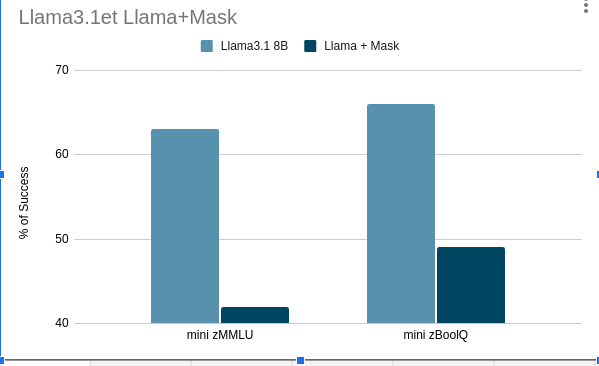
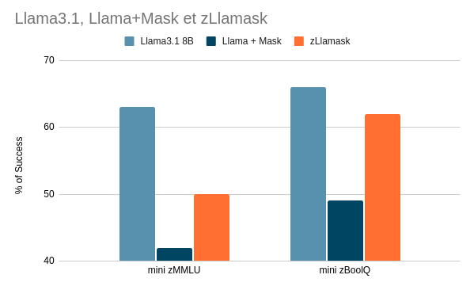

# FHE for AI Hackathon: Optimizing LLM Inference for FHE computation

This project focuses on optimizing large language model (LLM) inference within a Fully Homomorphic Encryption (FHE) framework.

## Overview

The core idea is to optimize LLM inference by combining clear-text inference with FHE inference, minimizing the costly FHE computations. We suppose the input of our LLM to be composed of non-FHE tokens, and FHE tokens (basically the sensitive words). Our approach follows these steps:

1. **Initial Inference in Clear**: Perform a first inference in clear text using a GPU, without attending the FHE tokens in the attention mechanism. This step is efficient and reduces the need for FHE.
  
2. **FHE Inference for Sensitive Tokens**: Run a second inference to compute the attention between the FHE-encrypted token(s) and the rest of the prompt. For example, if we mask 20% of the tokens, we reduce the attention computation in FHE by a factor of 5.

3. **Non-Standard Attention Masking**: Due to this hybrid approach, the attention mask is modified in a non-standard way, allowing us to limit the number of queries in the attention mechanism involving FHE.

## Evaluation

We constructed evaluation datasets to measure the performance drop caused by this optimization strategy. Specifically, we used:
- **MMLU**: A benchmark for multitask language understanding.
- **BoolQ**: A yes/no question dataset.

We used an LLM (Llama 3 70B, deployed with VLLM) to 'obfuscate' or detect the sensitive tokens, thereby creating non-trivial gaps in the attention mask. You can find the prompt strategy and dataset obfuscation scripts in the `benchmark_processor` folder.

### Results

We measured the performance drop after applying our optimization strategy. The performance gap is illustrated below:

### Further Evaluation

To mitigate this drop of performance we create a training dataset using two different datasets:
- **SQuAD**: Multiple choice questions based on text comprehension.
- **SlimOrca**: An instruction tuning dataset.

We fine-tuned Llama 3 8B-instruct on these datasets using LoRA (for fast iteration). The custom masking and training implementation can be found in the `masked_llm` folder.

#### Results

The fine-tuning results are presented below:

The performance gap has reduced, but there is still room for improvement!

## Try It Out

We created a demo on Hugging Face Spaces to compare the finetuned vs. non-finetuned models:
- [Llama without finetuning vs. Llama with finetuning](https://huggingface.co/spaces/ppaihack/zLlamaskClear)

Submit a request through the space, and you'll receive both outputs from the finetuned and non-finetuned models for comparison.

## Release

We release all the datasets and the adapter to Hugging face at the following links:

- [obfuscated version of BoolQ](https://huggingface.co/datasets/theostos/mini-zBoolQ)

- [obfuscated version of MMLU](https://huggingface.co/datasets/theostos/mini-zMMLU)

- [obfuscated version of SlimOrca](https://huggingface.co/datasets/theostos/mini-zSlimOrca)

- [obfuscated version of SQuAD](https://huggingface.co/datasets/theostos/mini-zSQuAD)

- [LoRA adapter for Llama 3.1 8b-instruct](https://huggingface.co/theostos/zLlamask)
## Testing the Efficiency of FHE Inference

In the `llm_fhe` folder, you'll find a script (`script.py`) to test the efficiency of our method. The script computes the attention mechanism corresponding to queries associated with encrypted tokens.

To observe the impact on computation time, vary the `num_fhe` argument of the `SingleHeadQGPT2ModelSimulationHybrid` class.

## Repository Structure

- **inference_server**: Contains the deployment code for Llama 3 70B using VLLM.
- **benchmark_processor**: Scripts for dataset obfuscation and prompt strategy.
- **masked_llm**: Implementation for custom masking and fine-tuning.
- **llm_fhe**: Script to test the efficiency of the FHE inference method.

## Conclusion

Our hybrid approach successfully reduces the computational burden of FHE inference while preserving model performance to a great extent. Fine-tuning the LLM further bridges the performance gap, offering a promising direction for efficient FHE-based LLM inference.

We invite you to explore and experiment!
